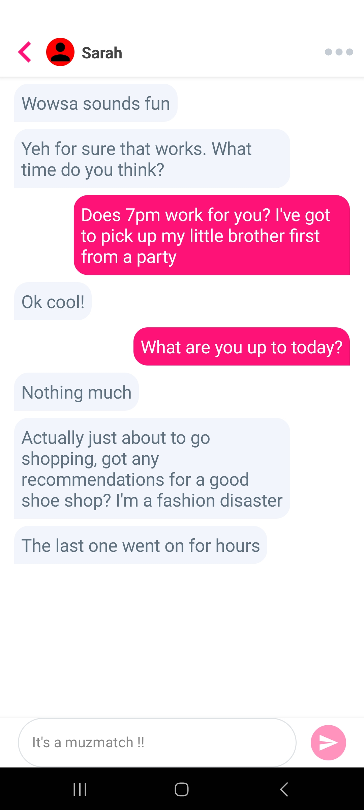

# ChatUI App

## Technologies Used
* Jetpack Compose
* Kotlin Coroutines and Flow
* Room database for persisting messages
* MVVM clean code architecture

## Message List and Text Entry Box
A Message List with a Text Entry box. This Message List’s 
displays the newest items at the bottom and the oldest at the top.
As you enter text into the Text Entry Box and tap "send" the item is added to the Message List.

## Message List Items
Received and sent messages are distinguished by aligning them to left or right.
The messages are encased in a "bubble".

## Item sectioning
If a previous message was sent more than an hour ago,
it is sectioned in the following format "{day} {timestamp}". For example, "Thursday 11:59".

## Persistent Storage and Observables
Persistent storage of messages in a Room database is implemented,
and there is an architecture allowing UI classes to observe data form the database
so that it always displays the latest information.

## Two way messages
The app has a way to toggle between 2 user Sarah and Peter.
Clicking on a more icon (3 horizontal dots) toggles the user.

## App limitations
* There are no tick marks on messages
* It is not possible to delete any message